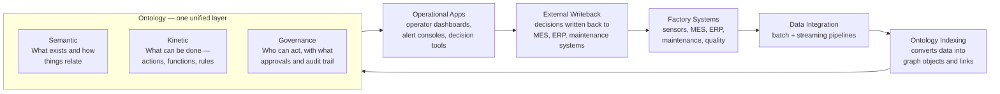
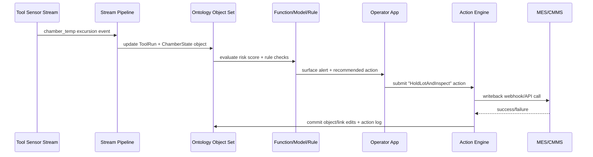
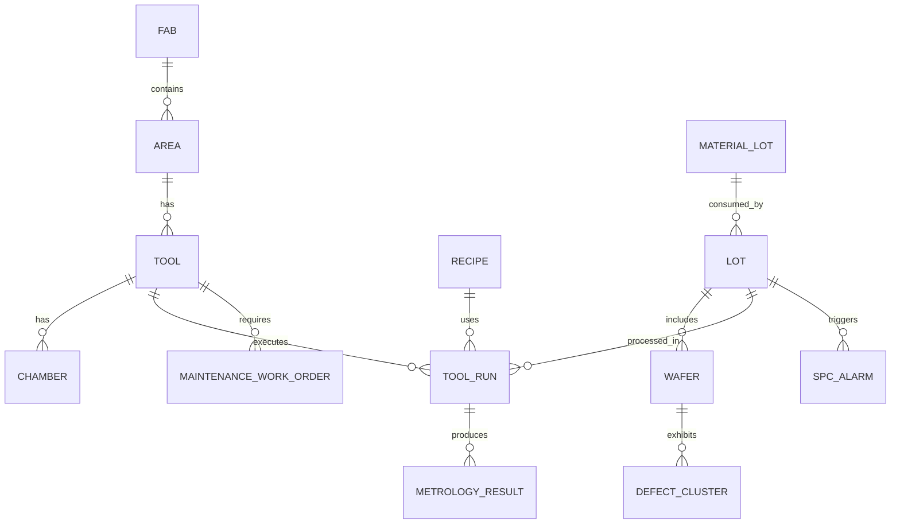
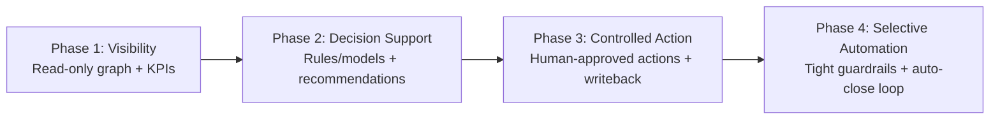
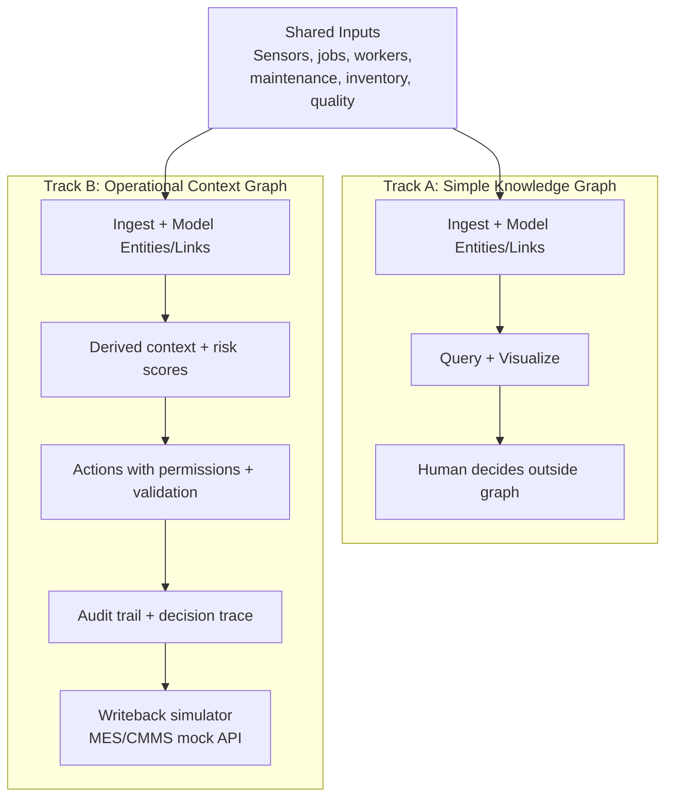
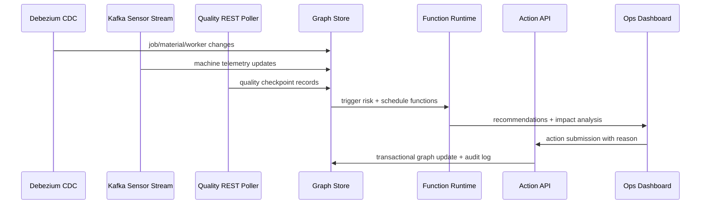

# Palantir Ontology for Live Data Transformation
**Research report for Intel Foundry engineering/factory datasets**  
Date: 2026-05-16

## Before You Start: A Simple Mental Model

A **knowledge graph** is like a detailed map — it shows what exists and how things connect. You can query it, explore it, and understand relationships. But the map itself does nothing.

An **operational context graph** is like a GPS — same underlying map, but now it tracks your live position, evaluates your situation against rules, recommends actions, and routes you in real time. When something changes (road closed, faster route), it responds.

Palantir's Ontology is closer to the GPS model. This document explains how to build one for a factory floor, and why that difference matters for real decisions. As a beginner, keep this analogy in mind: every design decision in this document is ultimately about making the GPS more accurate, more responsive, and safer to act on.

---

## 1) Executive Summary
Palantir’s Ontology approach is not just a graph data model. In current public documentation, it is positioned as an **operational layer** on top of datasets, virtual tables, and models, with both:
- Semantic primitives: objects, properties, links.
- Kinetic primitives: actions, functions, dynamic security, and writeback mechanisms.

The key differentiator vs. a regular knowledge graph is that Palantir combines:
- Live/near-live indexing from streams and batch sources.
- Decision logic (rules/functions/models) attached to graph entities.
- Transactional actioning and external-system writeback in the same layer.
- Runtime policy enforcement and decision lineage across data, logic, and action.

For Intel Foundry, this maps well to fab operations because you can model lots/wafers/tools/recipes/metrology as the semantic graph, then attach operational verbs (hold lot, reroute, launch maintenance, update MES status) with governance.

## 2) What Palantir Is Doing (Technical View)
## 2.1 Ontology as an operational layer
Palantir documentation explicitly describes the Ontology as an operational layer and as a decision-centric system, not only a semantic catalog. It integrates **data + logic + action + security** and is meant to support both human operators and AI agents in live workflows.

Practical consequence:
- It is not only “what exists and how entities relate.”
- It is also “what can be done, by whom, with what guardrails, and where the result gets written.”

## 2.2 “Contextual graph” in practice
Inference from sources: Palantir docs do not consistently formalize “contextual graph” as a strict product term, but the behavior is clear. The “context” comes from combining:
- Object graph state (objects/links/properties).
- Time-varying updates from streams and user edits.
- Bound logic assets (functions/models/rules).
- Security context computed at interaction time.
- Decision lineage (who/what/when/which workflow/version).

So your “graph” is not static topology; it is an operational state graph with permissions and decision history.

## 2.3 Live data transformation path
At a high level:
1. Ingest/transform raw sources to Foundry datasets/streams.
2. Index those into Ontology objects/links (batch or streaming Funnel pipelines).
3. Apply user/system edits via Actions (transactional object/link mutations).
4. Trigger logic/models/functions in-context.
5. Optionally write back to external systems (webhooks/APIs/connectors).
6. Capture lineage/telemetry for continuous improvement.

Important implementation details from docs:
- Streaming object indexing is designed for low-latency workflows, with consistency tradeoffs (exactly-once vs at-least-once).
- Stream-backed objects have current limitations; in docs, Actions are noted as not yet supported directly on stream-backed object types.
- Automations on stream-backed objects can execute within seconds of new data entering the ontology.

## 2.4 Architecture illustration

## 2.5 Closed-loop sequence (live fab event)

## 3) Comparison to Regular Knowledge Graphs
| Dimension | Traditional RDF/OWL KG | Typical Property Graph (e.g., Neo4j model) | Palantir Ontology approach |
|---|---|---|---|
| Core data model | RDF triples (subject-predicate-object); OWL adds formal semantics/reasoning | Nodes + typed relationships + properties | Objects/properties/links (similar graph semantics) |
| Main purpose | Representation + interoperability + inference | Graph querying and traversal | Decision-centric operations with app integration |
| Mutation semantics | Usually externalized in app/services | Usually externalized in app/services | Built-in Actions (including function-backed actions) |
| Operational writeback | Not inherent to RDF/OWL spec itself | Not inherent to model itself | First-class writeback/side effects (e.g., webhooks) |
| Governance coupling | Varies by stack; often separate IAM/policy layers | Varies by platform | Dynamic policy model tied to data/logic/action |
| Live streaming posture | Depends on surrounding infra | Depends on surrounding infra | Native stream-backed object indexing + automation hooks |
| End-user workflow layer | Usually separate products | Usually separate products | Tight coupling to operational apps and SDKs |

Bottom line:
- A regular KG gives you a semantic substrate.
- Palantir’s pattern is closer to **KG + workflow runtime + governed action system + external writeback orchestration**.

## 4) Intel Foundry Build Plan (Simple Step-by-Step)
Below is the practical implementation playbook for engineering/factory datasets.

## 4.1 Scope and assumptions
- Goal: shorten time-to-detection/time-to-decision/time-to-action for yield, quality, tool health, and cycle time.
- Scope: foundry engineering and factory operations (not enterprise-wide day 1).
- Assumption: you have streaming telemetry + transactional systems + historical data.

## 4.2 Step-by-step instructions
1. Choose 2-3 high-value decision loops first.
   - Example loops: excursion response, scrap prevention, dispatch/reroute, PM timing.
   - Output: KPI sheet with baseline and target deltas.

2. Inventory source systems and update frequency.
   - MES, FDC, APC, metrology, defect inspection, ERP, CMMS, SPC.
   - Tag each source as stream, micro-batch, or daily batch.
   - Output: system-to-domain matrix.

3. Define canonical factory ontology entities (v1).
   - Keep v1 minimal and action-oriented.
   - Start with: `Fab`, `Area`, `Tool`, `Chamber`, `Recipe`, `ProcessStep`, `Lot`, `Wafer`, `ToolRun`, `MetrologyResult`, `DefectCluster`, `SPCAlarm`, `MaintenanceWorkOrder`, `MaterialLot`.
   - Output: ontology dictionary (name, business definition, owner, key).

4. Define links and critical properties.
   - Links: `Lot ->currentStep-> ProcessStep`, `Lot ->processedOn-> Tool`, `Tool ->hasChamber-> Chamber`, `Wafer ->belongsTo-> Lot`.
   - Properties: timestamps, status, excursion flags, recipe version, control limits, yield/defect metrics.
   - Output: semantic schema + mandatory keys.

5. Build transformation pipelines before full ontology mapping.
   - Normalize IDs across systems (lot/tool/recipe/chamber).
   - Enforce event-time correctness and dedup rules.
   - Produce “refined operational datasets” for ontology indexing.
   - Output: tested silver/gold datasets with data-quality SLAs.

6. Index into ontology with latency classes.
   - Batch-backed object types for slower domains (supplier master, static specs).
   - Stream-backed object types for fast domains (tool telemetry summaries, alarms, lot state transitions).
   - Choose consistency mode intentionally for each stream-backed object type.
   - Output: indexed object sets with measured freshness.

7. Implement contextual graph features (derived context).
   - Derived properties: `isAtRisk`, `timeSinceLastPM`, `lotRiskScore`, `chamberDriftIndex`.
   - Join local graph neighborhood context: last N runs, same recipe family, sister chambers.
   - Output: operator-ready context fields.

8. Bind logic assets to graph entities.
   - Add deterministic functions/rules first (transparent, fast to validate).
   - Add model-backed functions for ranking/prediction only after rule baseline is stable.
   - Output: versioned logic registry with tests.

9. Define controlled actions (operational verbs).
   - Start with low-risk actions: annotate, assign owner, request inspection, create ticket.
   - Then medium-risk: hold lot, adjust route candidate, trigger PM recommendation.
   - Keep high-risk actions human-gated initially.
   - Output: action catalog with preconditions and required approvals.

10. Configure writeback contracts.
   - Decide per action: internal-only edit, writeback webhook, or both.
   - Add idempotency keys and failure handling.
   - Output: signed interface contract with MES/CMMS/ERP teams.

11. Add real-time automations and triage apps.
   - Stream-triggered notifications for excursion classes.
   - Operator console: object context + recommended actions + one-click submission.
   - Output: production triage workflow.

12. Harden governance and release workflow.
   - Row/column/object policies, purpose restrictions, action permissions.
   - Use branch-based change workflow for ontology/pipeline/action changes.
   - Output: approved governance and promotion process (dev -> test -> prod).

13. Pilot, measure, and scale.
   - Pilot on one fab area / one product family.
   - Measure precision/recall of alerts, MTTR, yield impact, false positives.
   - Scale only after measurable and stable uplift.
   - Output: stage-gate decision packet for expansion.

## 4.3 Suggested v1 factory contextual graph

## 4.4 Rollout phases (recommended)

## 5) Design Decisions That Matter Most
1. Event time vs processing time.
   - For live transformation, late/out-of-order event handling is usually the biggest hidden failure mode.
   - **What breaks if ignored:** a sensor event arrives 90 seconds late; your graph shows a tool as "healthy" during a window it was actually in alarm. Any decision made in that window is silently wrong, with no indication in the audit trail.

2. ID harmonization strategy.
   - If tool/lot/recipe identifiers are inconsistent, contextual graph quality degrades quickly.
   - **What breaks if ignored:** your MES calls it `LOT-001` and your FDC calls it `L001` — the graph creates two disconnected nodes for the same physical lot. Every traversal query misses half the history with no error, just incomplete results.

3. Action safety tiers.
   - Treat actions like production code deployment; each action needs blast-radius and rollback strategy.
   - **What breaks if ignored:** a buggy filter in a `hold_lot` action fires on 200 lots instead of 1. There is no rollback button — each MES writeback must be reversed manually, one by one.

4. Security at action-time, not just query-time.
   - Who can *see* is different from who can *change*.
   - **What breaks if ignored:** an engineer can view a lot's risk score and, without action-level permission checks, also trigger a hold — a decision that should require shift supervisor approval. The graph becomes an uncontrolled actuation path.

5. Branch-and-test discipline.
   - Ontology/pipeline/action changes should be rehearsed before merging to production.
   - **What breaks if ignored:** you add a new property to `ToolRun` and deploy directly to prod. All downstream functions referencing the old schema silently receive null values and produce wrong outputs until someone notices.

## 6) Common Pitfalls to Avoid
- Modeling too many object types in v1. *If you model `Wafer`, `WaferSlot`, `WaferCarrier`, and `WaferBatch` in week 1, you'll spend most of your time on schema debates instead of building decision logic.*
- Mixing low-trust and high-trust data in the same action path. *If a `hold_lot` action can be triggered by either a validated SPC alarm or a raw unvalidated sensor spike, one noisy sensor reading can halt production.*
- Writing back to external systems without idempotency and compensation logic. *Your action fires, the MES API times out, you retry — the lot is now held twice, or the work order is created twice, and reconciliation is manual.*
- Launching model-driven actions before rule-based baselines are validated. *If your deterministic rules don't already catch the obvious cases correctly, you have no way to tell whether the ML model is adding value or just adding noise and false positives.*
- Ignoring operator UX; even strong graph/model logic fails if triage workflow is slow. *If an alert surfaces but the operator needs 5 clicks to see context and 3 more to act, they'll route around the system via Slack and your graph has zero real adoption.*

## 7) What This Means for Intel Foundry
If your goal is live factory decisioning, the winning pattern is:
- Build a compact, high-trust object graph of fab operations.
- Attach transparent decision logic first, then models.
- Introduce actions gradually with strict governance and measurable business KPIs.

That gives you a practical “operational knowledge graph” rather than a passive graph repository.

## 8) Recommended Datasets for the Demo

To make the demo concrete and runnable without proprietary data, use one or both of these freely available datasets:

**Primary: AI4I 2020 Predictive Maintenance Dataset (UCI)**
- What it is: 10,000 synthetic but realistic records of machine operations with tool wear, temperature, torque, rotational speed, and failure type labels.
- Why it fits: directly maps to `Machine`, `ToolRun`, `MaintenanceEvent`, and `QualityCheckpoint` entities in the demo schema.
- Source: UCI Machine Learning Repository — search “AI4I 2020 Predictive Maintenance Dataset”
- Use for: machine failure prediction, maintenance action triggering, and the Track A vs Track B comparison.

**Secondary: SECOM Semiconductor Manufacturing Dataset (UCI)**
- What it is: 1,567 wafer lots × 590 sensor features, with pass/fail yield labels.
- Why it fits: maps closely to the Intel Foundry entities (`Lot`, `Wafer`, `ProcessStep`, `SPCAlarm`) and gives you a real sense of the data density in fab environments.
- Source: UCI Machine Learning Repository — search “SECOM”
- Use for: yield prediction, SPC alarm modeling, and excursion response workflows.

**Starting recommendation:** Begin with AI4I (simpler structure, fewer features, clearer failure signal). Once your graph, actions, and decision logic are stable, layer in SECOM to experience higher-dimensional sensor data and sparse labels — which is much closer to real fab conditions.

## 9) Demo Blueprint: Show the Difference Between Simple KG and Operational Context Graph
## 9.1 Demo objective
Build a manufacturing floor demo with two tracks using the same data:
- Track A: semantic-only knowledge graph.
- Track B: operational context graph with decisions, actions, and writeback simulation.

Success criterion: users should see why Track B improves speed and consistency of decisions.

## 9.2 Track comparison architecture

## 9.3 Concrete demo scope (from your email, adapted)
Objects:
- `Machine`, `ProductionLine`, `Job`, `Worker`, `MaintenanceEvent`, `Material`, `QualityCheckpoint`.

Core links:
- `Machine BELONGS_TO ProductionLine`
- `ProductionLine RUNNING_JOB Job`
- `Job REQUIRES Machine`
- `Job USES Material`
- `Worker ASSIGNED_TO (Machine|Job|MaintenanceEvent)`
- `Job HAS_QUALITY QualityCheckpoint`

Actions:
- `reschedule_job`
- `trigger_maintenance`
- `allocate_worker`
- `order_material`

Functions:
- `predict_machine_failure` (risk score + confidence)
- `optimize_job_schedule` (constraint solver output)
- `calculate_impact_analysis` (affected entities + risk + approvals)

## 9.4 Demo dataflow and runtime

## 10) Implementation Plan For the Demo Project
## 10.1 12-week plan
1. Weeks 1-2: scaffold and baseline.
   - Use a graph app scaffold (e.g., `create-context-graph`) to stand up backend/frontend quickly.
   - Implement Track A first with static sample manufacturing data (start with the AI4I dataset from section 8).
   - Learning goal: understand how to translate a flat dataset into graph entities and relationships, and experience the gap between a raw CSV and a queryable graph.

2. Weeks 3-4: ontology v1 + visualization.
   - Add the object/link schema above.
   - Build graph explorer and machine/job/worker views.
   - Learning goal: see how a semantic schema makes data browsable in ways a flat table cannot — and notice which queries are natural in a graph vs. awkward.

3. Weeks 5-6: live ingestion.
   - Add Kafka sensor streaming.
   - Add CDC for scheduling/inventory tables.
   - Add 5-minute polling for quality API if streaming is unavailable.
   - Learning goal: understand what "live" actually means in practice — event time vs. processing time, deduplication, and why batch ETL intuitions break here.

4. Weeks 7-8: actions + governance.
   - Implement `reschedule_job` and `allocate_worker`.
   - Enforce role checks and require justification text.
   - Store immutable action log.
   - Learning goal: understand why actions need governance (permissions, justification, audit trail) and not just logic — this is the core difference from a regular API call.

5. Weeks 9-10: functions + simulation.
   - Add `predict_machine_failure`.
   - Add impact-analysis function before action commit.
   - Add sandbox scenario mode for what-if analysis.
   - Learning goal: see the difference between rule-driven and model-driven decisions, and how showing impact before an action changes operator behavior.

6. Weeks 11-12: evaluation and business readout.
   - Run controlled scenarios comparing Track A vs Track B.
   - Capture latency, quality, and operator-effort metrics.
   - Prepare demo narrative with before/after decisions.
   - Learning goal: quantify when the operational graph actually helps vs. when a simpler approach would have been sufficient — this is the honest audit of the pattern's value.

## 10.2 Graduation criteria (demo exit gates)
Use these as pass/fail gates:
- Data freshness: sensor event visible in graph within 5 seconds.
- Query latency: dependency query path under 100 ms for target traversals.
- Action latency: action validation + commit under 2 seconds.
- Traceability: every action stores actor, reason, timestamp, and impact summary.
- Outcome signal: measurable reduction in simulated unplanned downtime and/or schedule disruption.

## 10.3 Recommended tech mapping (Foundry vs OSS demo)
| Capability | Foundry-native path | OSS demo analog |
|---|---|---|
| Semantic model | Ontology object/link types | Neo4j schema constraints + labeled graph |
| Live updates | Funnel/object indexing | Kafka consumers + CDC upserts |
| Decision logic | Functions / model integration | FastAPI services + Celery workers |
| Controlled edits | Action types + rules + side effects | Action API with RBAC and transaction hooks |
| Governance and audit | Object/action permissions + logs | App-layer RBAC + append-only audit table |
| User apps | Workshop / Slate / Object Explorer | React + graph UI + decision timeline |

## 10.4 Optional secondary repos (good for exploration, not core path)
- `GitNexus`: useful for understanding client-side graph exploration patterns in code intelligence.
- `Axon`: useful for understanding MCP exposure patterns over graph-backed intelligence.
- `LangGraph` examples: useful if you want explicit reasoning/acting state-machine patterns.

Recommendation: keep these in a “phase 2 learning track” so the core manufacturing demo does not get over-scoped.

## Sources
1. https://www.palantir.com/docs/foundry/ontology/overview  
2. https://www.palantir.com/docs/foundry/architecture-center/ontology-system  
3. https://www.palantir.com/docs/foundry/object-link-types/type-reference  
4. https://www.palantir.com/docs/foundry/object-indexing/overview  
5. https://www.palantir.com/docs/foundry/object-indexing/funnel-streaming-pipelines  
6. https://www.palantir.com/docs/foundry/object-backend/overview  
7. https://www.palantir.com/docs/foundry/object-edits/overview  
8. https://www.palantir.com/docs/foundry/object-edits/how-edits-applied  
9. https://www.palantir.com/docs/foundry/action-types/webhooks  
10. https://palantirfoundation.org/docs/foundry/automate/streaming  
11. https://www.palantir.com/docs/foundry/platform-overview  
12. https://www.palantir.com/docs/foundry/model-integration/overview/index.html  
13. https://www.palantir.com/docs/foundry/workshop/scenarios-overview  
14. https://www.palantir.com/docs/foundry/global-branching/overview  
15. https://www.palantir.com/docs/foundry/ontology-sdk/overview  
16. https://palantirfoundation.org/docs/foundry/ontologies/volume-usage  
17. https://investors.palantir.com/files/2025%20FY%20PLTR%2010-K.pdf  
18. https://www.w3.org/TR/rdf11-concepts/  
19. https://www.w3.org/TR/owl-overview/  
20. https://neo4j.com/docs/getting-started/appendix/graphdb-concepts/  
21. https://www.palantir.com/assets/xrfr7uokpv1b/2T3BgBpe3drnqBaSTCXl6O/bdc9445d10053eb84b3f9487e63fc2d7/Whitepaper_-_Accelerating_Research_and_Development_in_the_Semiconductor_Industry.pdf
22. https://www.palantir.com/docs/foundry/action-types/overview/  
23. https://www.palantir.com/docs/foundry/functions/overview/  
24. https://github.com/neo4j-labs/create-context-graph  
25. https://neo4j.com/labs/agent-memory/  
26. https://github.com/getzep/graphiti  
27. https://debezium.io/documentation/  
28. https://kafka.apache.org/documentation/streams/  
29. https://microsoft.github.io/graphrag/
30. https://github.com/abhigyanpatwari/GitNexus  
31. https://github.com/harshkedia177/axon  
32. https://github.com/langchain-ai/langgraph
